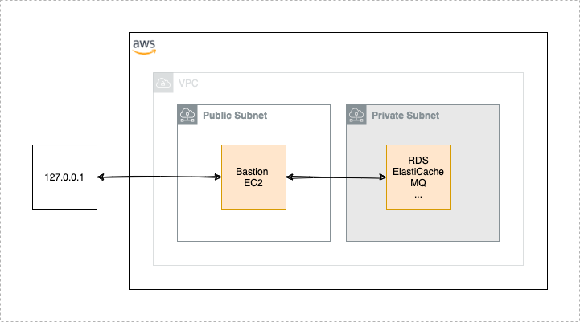

# AWS Proxy

[](https://github.com/kj187/aws_proxy/releases/latest)
[](/LICENSE.md)
[](https://saythanks.io/to/mail%40kj187.de)
[](https://github.com/goreleaser)

The AWS Proxy enables you to reach AWS services which are protected due to a private network.

## Problem

In a modern infrastructure architecture, services like RDS, ElastiCache, ElasticSearch, MQ etc. should be live in a protected private network which is not accessable from the public. Some of these services are providing web interfaces which are quite helpful to debug problems. But how is it possible to reach them in the browser? And how is it possible to have a look in a database or any other AWS service which is protected and not accessable via the AWS Console? 

One way to solve this kind of problem is to open a **proxy** to these services. 
And on this way the **AWS Proxy** as a small CLI utility comes into play to support you with that.

<br>
<p align="center">
  
</p>

## Installation

### Download from releases page

- Go to the [Releases Page](https://github.com/kj187/aws_proxy/releases)
- Downloading the binary for your operating system: e.g., if you are on a Mac, download `aws_proxy_darwin_amd64`, if you are on Windows, download `aws_proxy_windows_amd64.exe` etc
- Rename the downloaded file to `aws_proxy`
- Add execute permissions to the binary. On Linux and Mac: `chmod u+x aws_proxy`
- Put the binary somewhere on your PATH. On Linux and Mac: `mv aws_proxy /usr/local/bin/aws_proxy`

## Requirements

### Bastion server 

To open a proxy to your private network services, we need something like an bridge between your public and your private network. This kind of bridge is called a **jump host** or a **bastion server**. This is a server which lives in your public network and has access to your private network. For security reasons you should only allow SSH as ingress. Also, you need to have access from you local machine to the bastion server. The AWS Proxy utility assumes that you have access to the bastion with a valid user and a valid SSH key (with or without a passphrase). 

### AWS CLI access

AWS Proxy is build like a wizard. You dont need to know specific endpoint or ports, it will fetch all that data from AWS via the AWS SDK. Everything you need is a valid set of CLI credentials. The best way is to have them stored as a profile in `~/.aws`. 


## Supported AWS services

- RDS

### Planned services

- Elasticsearch (API and Kibana)
- Elasticache (Redis)
- MQ Service (RabbitMQ)

## Configuration

The whole configuration for AWS Proxy is stored in `~/.aws_proxy.yaml`. 
To create that file with a default set of configuration, just execute:

```
aws_proxy config
```

### AWS

You need to specify the region and your AWS profile

```
aws:
  region: eu-central-1
  profile: myprofile
```

### Bastion

If your bastion server has a static IP and you know that, you could add this information to the configuration file 
`~/.aws_proxy.yaml`

```
bastion:
    public_ip: XX.XX.XX.XX
```

If you dont know that IP or your bastion server does not have a static IP, AWS Proxy can find that with a tag query. 
The default tag query is that your Bastion has a tag with the key `Name` and the value `bastion`. You could change that filter in the configuration file. You could also add multiple filter if your AWS account provides multiple different bastion instances.

``` 
bastion:
  tag_filter:
  - name: tag:Name
    value: bastion
```

The default SSH **user** is `ec2-user`, the default **port** is `22` and the default **identity file** is `$HOME/.ssh/id_rsa`. 
You could change all these default in the configuration file `~/.aws_proxy.yaml`. 

```
bastion:
  ssh:
    user: ec2-user
    identity_file: ~/.ssh/rd_rsa
    port: 22
```

### Proxy

If you want to change the local proxy ports, just update the following part

```
proxy:
  local_ports:
    rds: 6546
```

## Help

If you need help or if you need some more background information, just use one of the flags:

```
aws_proxy --help
aws_proxy --verbose
```

## Examples

### Amazon RDS

The following command will give you a complete list of all your existing RDS databases. You can choose the one you need. 

```
aws_proxy proxy:rds 
```

You can skip this step if you know the database you want to proxy. Just add the DBName as flag

```
aws_proxy proxy:rds -n mydbname
```